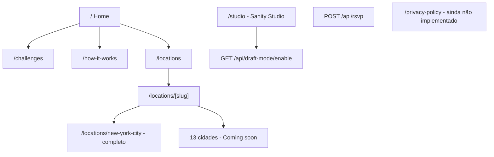
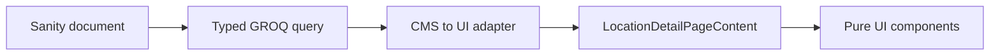

# SwingRush - CMS Architecture Handoff

Atualizado em: 15 de agosto de 2026  
Baseline de código: commit `28b4fff` (`feat: build locations pages`)

## 1. Objetivo deste documento

Este arquivo registra a história do produto, o sitemap implementado, as decisões de frontend e o estado real da integração com Sanity. Ele deve ser usado como contexto inicial pelo agente responsável por desenhar e implementar a arquitetura CMS via MCP.

O código atual segue uma estratégia **UI-First / Headless-Ready**:

- Componentes visuais recebem conteúdo exclusivamente por props.
- Tipos de frontend não conhecem `_id`, GROQ, `image.asset` ou tipos gerados pelo Sanity.
- Mocks tipados são hoje a fonte de dados das Locations.
- A integração futura deve usar uma camada de query/repository e um adapter para transformar documentos do Sanity nos contratos da UI.
- Não conectar clientes, queries ou lógica CMS diretamente aos componentes de apresentação.

## 2. História e direção do produto

SwingRush é uma experiência de arena golf: dez desafios de habilidade, múltiplas categorias e uma linha de chegada. O participante percorre o gauntlet individualmente ou em equipe, usando tempo como placar.

A identidade visual implementada vem do Figma Hackaton e usa:

- Fundo preto, branco e vermelho SwingRush `#F92524`.
- Owners Trial XNarrow Black Italic para display.
- Forma DJR Text para corpo.
- Forma DJR Mono para navegação, placares e agenda.
- Layout editorial mobile, imagens de arena e animações split-flap.

Referências principais do Figma:

- Locations index: `https://www.figma.com/design/98BC7yEVdl4GKwe66XBvv1/Hackaton?node-id=1495-6207`
- New York detail: `https://www.figma.com/design/98BC7yEVdl4GKwe66XBvv1/Hackaton?node-id=1495-6357`

### Evolução implementada

1. A base Next.js, navbar, footer, tokens, fontes e Studio embutido foram criados.
2. A Home ganhou hero em vídeo, narrativa da arena, cards de conceito e CTA.
3. How It Works ganhou hero em vídeo e accordions editoriais.
4. Challenges ganhou uma lista interativa split-flap com dez desafios.
5. Locations foi construída UI-first com 14 cidades.
6. New York tornou-se a página-modelo completa para o futuro documento CMS.
7. As outras 13 cidades receberam um estado mínimo `Coming soon`, sem conteúdo fictício duplicado.

Commits recentes que ajudam a reconstruir essa história:

- `28b4fff` - Locations index, New York detail, mocks e contratos.
- `5e863e4` / `ec331a5` - ajustes de layout e copy dos Challenges.
- `8454e96` / `c248d12` / `48b51d3` - How It Works.
- `33c58dc` e commits anteriores - Challenges e animação split-flap.

### User stories atuais

| Persona | História | Estado atual |
|---|---|---|
| Visitante | Como visitante, quero entender rapidamente o que é SwingRush e sentir a atmosfera da arena. | Implementada na Home. |
| Golfista | Como golfista, quero entender regras, divisões, categorias, tee times e scoring antes de participar. | Implementada em How It Works. |
| Golfista | Como golfista, quero explorar os dez desafios e comparar open/elite. | Implementada em Challenges; imagens individuais ainda são placeholders. |
| Participante | Como participante, quero descobrir em quais cidades haverá evento e em quais datas. | Implementada em Locations. |
| Participante | Como participante, quero abrir uma cidade e consultar venue, agenda, ingressos e informações práticas. | Completa somente para New York; 13 cidades usam Coming soon. |
| Interessado | Como interessado, quero entrar na waitlist ou pre-sale. | CTA/âncora visual implementada; captura real ainda não existe. |
| Voluntário | Como voluntário, quero conhecer benefícios e me inscrever. | Conteúdo e CTA visual implementados; fluxo real ainda não existe. |
| Editor | Como editor, quero ordenar cidades, controlar Coming soon/completo e editar o conteúdo sem alterar componentes. | Objetivo da próxima arquitetura Sanity. |
| Editor | Como editor, quero pré-visualizar drafts e publicar sem expor conteúdo incompleto. | Infraestrutura parcial de Draft Mode/Presentation já existe; fluxo ainda não validado ponta a ponta. |
| Motor de busca | Como crawler, quero receber metadata e sitemap apenas de páginas públicas. | Metadata parcial existe; sitemap/robots ainda não existem. |

## 3. Sitemap atual



### Rotas públicas

| Rota | Estado | Fonte atual | Observações |
|---|---|---|---|
| `/` | Implementada | Copy e assets nos componentes | Home não está no escopo Sanity atual. |
| `/challenges` | Implementada | `CHALLENGE_ITEMS` local | Dez desafios; imagens ainda usam placeholder compartilhado. |
| `/how-it-works` | Implementada | Constantes locais | Hero e cinco accordions. |
| `/locations` | Implementada | `LOCATIONS_PAGE_CONTENT` | Lista tipada com 14 cidades. |
| `/locations/new-york-city` | Implementada | `NEW_YORK_LOCATION_DETAIL` | Página-modelo completa. |
| `/locations/{outros-13-slugs}` | Implementada | Resumo da listagem | Nome, datas e `Event details are coming soon`. |
| `/privacy-policy` | Não implementada | Nenhuma | Já existe link no footer e hoje resulta em 404. |

### Rotas de sistema

| Rota | Método | Estado |
|---|---|---|
| `/studio/[[...tool]]` | GET | Studio Sanity embutido. |
| `/api/draft-mode/enable` | GET | Ativa Draft Mode via `next-sanity`. |
| `/api/rsvp` | POST | Valida com Zod e envia e-mail via Resend. Nenhum formulário atual chama essa rota. |

### SEO técnico ainda ausente

- Não existe `app/sitemap.ts` ou `sitemap.xml` gerado.
- Não existe `app/robots.ts`.
- Metadata existe por página, e Locations detail deriva metadata do mock.
- A futura geração do sitemap deve incluir somente documentos públicos/visíveis do Sanity.

## 4. Inventário narrativo por página

### Home `/`

Ordem das seções:

1. Hero full-screen em vídeo: `READY / SET / GOLF`.
2. Arena: `THE ARENA / GOLF GAUNTLET`.
3. Quatro histórias expansíveis:
   - Ten one-of-a-kind skills challenges.
   - It's crunch time.
   - Skill divisions are the new handicap.
   - Compete as a single or a team.
4. CTA invertido: `SWING IN / THE ARENA`.
5. Footer compartilhado.

Assets principais: `Sizzzle one.webm`, `Sizzzle one.mp4`, `hero-poster.jpg`, `challenge-skills.avif`, `crunch.avif` e `team.avif`.

### Challenges `/challenges`

Lista interativa com estes IDs e títulos:

1. `drive-through` - Drive Through.
2. `stinger-shot` - Stinger Shot.
3. `rough-lie` - Rough Lie.
4. `high-flyer` - High Flyer.
5. `flag-hunter` - Flag Hunter.
6. `bunker-splash` - Bunker Splash.
7. `bump-and-run` - Bump & Run.
8. `up-and-down` - Up & Down.
9. `flop-shot` - Flop Shot.
10. `clutch-putt` - Clutch Putt.

Cada item contém número, título, imagem/alt, club, shot, distance, target height para open/elite, time limit e description. Hoje todos usam `challenge-skills.avif` como placeholder; não assumir que esse é o asset definitivo de cada desafio.

### How It Works `/how-it-works`

- Hero em vídeo com o título `HOW IT WORKS`.
- Bloco vermelho `THE ARENA / GOLF GAUNTLET`.
- Introdução sobre competir sob as luzes da arena.
- Accordions:
  - The Challenges.
  - Tee Times.
  - Scoring.
  - Divisions.
  - Categories.
- Categories possui subseções para Singles, Doubles e Foursomes.

### Locations index `/locations`

- Título `LOCATIONS`.
- Introdução sobre elite division, open division, limite de 60 minutos e equipes.
- A linha inteira de cada cidade é um link para `/locations/[slug]`.
- CTA de cada linha: `Join Waitlist`.
- Estado vazio tipado: `New SwingRush locations are coming soon.`

| Ordem | Cidade | Slug | Datas atuais | Detalhe |
|---:|---|---|---|---|
| 1 | Boston | `boston` | 2027-03-09 a 2027-03-14 | Coming soon |
| 2 | New York City | `new-york-city` | 2027-02-18 a 2027-02-21 | Completo |
| 3 | Philadelphia | `philadelphia` | 2027-04-08 a 2027-04-11 | Coming soon |
| 4 | Atlanta | `atlanta` | 2027-04-08 a 2027-04-11 | Coming soon |
| 5 | Detroit | `detroit` | 2027-04-08 a 2027-04-11 | Coming soon |
| 6 | Chicago | `chicago` | 2027-04-08 a 2027-04-11 | Coming soon |
| 7 | Dallas | `dallas` | 2027-04-08 a 2027-04-11 | Coming soon |
| 8 | Houston | `houston` | 2027-04-08 a 2027-04-11 | Coming soon |
| 9 | Minneapolis | `minneapolis` | 2027-04-08 a 2027-04-11 | Coming soon |
| 10 | Denver | `denver` | 2027-04-08 a 2027-04-11 | Coming soon |
| 11 | Phoenix | `phoenix` | 2027-04-08 a 2027-04-11 | Coming soon |
| 12 | Los Angeles | `los-angeles` | 2027-04-08 a 2027-04-11 | Coming soon |
| 13 | San Francisco | `san-francisco` | 2027-04-08 a 2027-04-11 | Coming soon |
| 14 | Seattle | `seattle` | 2027-04-08 a 2027-04-11 | Coming soon |

As datas de abril são mocks provisórios e não devem ser tratadas como calendário confirmado sem validação editorial.

### New York detail `/locations/new-york-city`

Esta é a referência visual e estrutural para todas as futuras Locations completas.

Conteúdo atual:

- Hero: vídeo local SwingRush e poster estático para `prefers-reduced-motion`.
- Cidade: New York City.
- Venue: Javits Center.
- Evento: 18 a 21 de fevereiro de 2027.
- CTA superior `Join Waitlist` aponta para `#ticket-info`.
- Introdução sobre o evento inaugural.
- Features 3:2:
  - `10 Challenges`.
  - `100's of Golfers`.
  - `1 Finish Line`.
- Schedule: quatro dias, quatro sessões por dia, das 9 AM às 9 PM.
- Ticket Info:
  - Private Pre Sale em 18 de novembro de 2026.
  - General Public Sale em 2 de dezembro de 2026.
- Important Information:
  - Location.
  - Parking.
  - Check-in.
  - Volunteer, benefícios e CTA.

Os três assets de feature foram exportados do Figma para `public/images/locations/new-york/`.

## 5. Comportamento global que o CMS não deve quebrar

### Responsividade

- Somente viewports abaixo de `480px` exibem a aplicação.
- A partir de `480px`, o layout global oculta o app e exibe `DesktopNotice`.
- A regra é por largura, sem detecção de dispositivo.
- Conteúdo mobile usa gutter lateral de `1rem` e largura máxima aproximada de `402px`.

### Navbar

- `/` e `/how-it-works`: transparente sobre o hero e vermelha após o limite do hero.
- `/locations/new-york-city`: usa a mesma lógica de hero.
- `/challenges` e `/locations`: transparente no topo e vermelha após cerca de `10vh` de scroll.
- Outras Location details `Coming soon`: vermelha desde o topo.
- Ao abrir o menu, a navbar/painel é vermelho independentemente da rota.

Observação visual conhecida: em New York, a navbar é tecnicamente transparente, mas o vídeo começa depois da altura do header (`top-[3.625rem]`). Por isso ela revela preto no topo em vez de revelar vídeo como na Home. Isso é uma decisão de layout pendente, não um problema de Sanity.

### Footer e CTAs

- Footer é compartilhado e não deve ser duplicado em documentos de página.
- O footer contém Challenges/Register Now, Locations, How It Works e Privacy Policy.
- URLs sociais ainda são `#`.
- `Register Now` ainda aponta para `/challenges`.
- O CTA `Contact Us` da Home ainda não tem destino.
- Join Waitlist, pre-sale e volunteer ainda são âncoras internas, não formulários reais.

## 6. Contratos UI-first existentes

Fontes de verdade do frontend:

- `types/locations.ts`: `LocationsPageContent`, `LocationListItem`, `LocationDateRange` e CTA.
- `types/location-detail.ts`: `LocationDetailPageContent` e os tipos menores.
- `lib/format-location-date.ts`: formatação UTC estável com `Intl.DateTimeFormat`.

Contrato principal de detalhe:

```text
LocationDetailPageContent
|- id, slug, city, venueName, dates, introduction
|- seo { title, description }
|- hero { ariaLabel, webmSrc, mp4Src, posterSrc }
|- primaryAction { label, href }
|- features[] { id, title, description, image }
|- schedule { title, days[] { date, sessions[] } }
|- ticketInfo { id, title, releases[] }
`- importantInformation { title, blocks[], volunteer }
```

Fluxo desejado:



Regras para o adapter:

- Resolver image/file URLs e dimensões antes de passar props.
- Converter `slug.current` para `slug` string.
- Gerar IDs estáveis para arrays quando necessário, sem expor `_key` como requisito da UI.
- Entregar datas como `YYYY-MM-DD` e horários como `HH:mm`.
- Não passar objetos Sanity brutos para os componentes.
- Preservar os mocks como fixture de desenvolvimento/teste enquanto a migração não estiver validada.

## 7. Estado real do Sanity

### O que já existe

- Sanity Studio v6 embutido em `/studio`.
- Dataset padrão `production`.
- API version padrão `2026-02-01`.
- Structure Builder com uma seção `Cities`.
- Presentation Tool e endpoint de Draft Mode.
- `SanityLive` e `VisualEditing` limitados a `app/locations/layout.tsx`.
- Variáveis esperadas em `.env.example`:
  - `NEXT_PUBLIC_SANITY_PROJECT_ID`
  - `NEXT_PUBLIC_SANITY_DATASET`
  - `NEXT_PUBLIC_SANITY_API_VERSION`
  - `SANITY_API_READ_TOKEN`

### Schema legado atual

Existe somente `cityPage`, com:

- `title`
- `slug`
- `heroHeadline`
- `heroDescription`
- `isPublished`

Esse schema antecede a UI final de Locations e é insuficiente para o contrato atual. As queries `CITY_PAGE_SLUGS_QUERY` e `CITY_PAGE_QUERY` refletem esse formato antigo.

### Importante

- As páginas de Locations não usam mais `sanityFetch` neste momento.
- As queries antigas não possuem consumidores ativos.
- `SanityLive` permanece montado no layout de Locations e pode emitir tentativas de reconexão quando o projeto/token não está configurado.
- Por regra do projeto, não mover Live/Visual Editing para `app/layout.tsx` sem decisão explícita da equipe.
- Home, Challenges e How It Works continuam fora do runtime Sanity nesta fase.

## 8. Arquitetura CMS recomendada para a fase Locations

Antes de alterar arquivos locais, o agente deve usar o MCP do Sanity para inspecionar o projeto, dataset, documentos existentes e capacidades disponíveis. Não presumir que o estado remoto corresponde ao schema local.

Modelo mínimo recomendado:

### `locationsPage` singleton

- title
- introduction
- emptyState
- seo title/description

A lista deve ser derivada dos documentos `location`, evitando duplicar cidade, slug e datas no singleton.

### `location` document

- city/name
- slug
- sortOrder
- detailStatus: `comingSoon` ou `complete`
- startDate e endDate
- venueName
- introduction
- SEO title/description
- hero media: poster, webm/mp4 ou estratégia de arquivo definida após inspeção MCP
- primaryAction
- features array
- schedule title, days e sessions
- ticketInfo e releases
- information blocks
- volunteer content, benefits e action

Usar o estado nativo draft/published do Sanity para publicação editorial. `detailStatus` representa a experiência da rota e não substitui draft/published.

### Validações editoriais mínimas

- Cidade e slug obrigatórios.
- Datas ISO válidas e `endDate >= startDate`.
- `sortOrder` obrigatório para ordenação determinística.
- Feature completa exige título, descrição, imagem e alt.
- Location com `detailStatus=complete` exige venue, hero, introdução e conteúdo essencial.
- Horário de sessão deve seguir `HH:mm`.
- Links aceitam âncoras internas e URLs, com validação compatível com os casos atuais.

### Queries/repositories esperados

- Buscar singleton da listagem.
- Buscar Locations públicas ordenadas para a listagem e `generateStaticParams`.
- Buscar uma Location por slug.
- Projetar somente os campos necessários.
- Adicionar adapter separado para list item e detail page.
- Gerar metadata e sitemap a partir do mesmo repositório, evitando consultas divergentes.

## 9. Sequência de trabalho sugerida ao agente via MCP

1. Ler `AGENTS.md`, este handoff e os contratos TypeScript.
2. Inspecionar via MCP o projeto/dataset Sanity real e listar documentos `cityPage` existentes.
3. Comparar dados remotos com os 14 mocks; não apagar documentos sem aprovação.
4. Propor/implementar os schemas `locationsPage` e `location`, reutilizando object types para mídia, ação, feature, schedule e information.
5. Definir migração de `cityPage` legado se houver documentos reais; caso contrário, substituí-lo de forma limpa.
6. Criar/atualizar documentos iniciais pelo MCP usando os mocks como seed, marcando 13 cidades como `comingSoon` e New York como `complete`.
7. Criar queries tipadas e adapters que retornem exatamente os contratos UI-first.
8. Migrar `/locations` e `/locations/[slug]` para o repositório CMS sem inserir fetching nos componentes.
9. Preservar fallback/fixtures até a validação visual e editorial ser concluída.
10. Implementar `app/sitemap.ts` e `app/robots.ts` somente após definir a política de publicação/visibilidade.
11. Validar Draft Mode, Presentation/Visual Editing e comportamento sem credenciais.

## 10. Critérios de aceite da integração futura

- O visual não muda ao trocar mock por Sanity.
- New York renderiza todo o conteúdo e assets pelo adapter.
- As outras 13 cidades continuam com estado `Coming soon` até receberem conteúdo completo.
- Slug desconhecido retorna 404.
- Datas permanecem estáveis entre servidor e cliente, sem deslocamento de timezone.
- `generateStaticParams`, metadata e sitemap respeitam somente Locations públicas/visíveis.
- Draft Mode mostra alterações não publicadas; produção não mostra drafts.
- Componentes de UI continuam sem imports de `sanity`, queries ou clientes.
- A aplicação funciona sem overflow entre 320px e 479px.
- A partir de 480px, somente o aviso global aparece.
- Navbar, âncoras, foco, reduced motion e footer mantêm o comportamento atual.
- Lint, TypeScript e build passam.

## 11. Dívidas e decisões pendentes

- Definir se o vídeo de New York deve ocupar também a área atrás da navbar.
- Criar `/privacy-policy` ou remover temporariamente o link.
- Definir destinos reais para Contact Us, Register Now, waitlists e volunteer.
- Definir URLs sociais.
- Substituir imagens placeholder individuais dos dez Challenges.
- Decidir quando Home, Challenges, How It Works, navbar e footer entram no CMS.
- Condicionar `SanityLive` quando não houver configuração válida para evitar reconexões locais.
- Atualizar o README após a arquitetura CMS ser concluída.
- O `npm run build` com Turbopack já apresentou travamento ambiental; `next build --webpack` concluiu com sucesso no último ciclo.

## 12. Guardrails finais

- Não adicionar Sanity globalmente por conveniência.
- Não remodelar a UI para acomodar o CMS; o CMS deve adaptar-se ao contrato visual aprovado.
- Não duplicar dados da listagem e do detalhe quando puderem vir do mesmo documento Location.
- Não publicar as datas mockadas de abril como datas confirmadas sem revisão editorial.
- Não remover mocks antes de existir paridade visual, testes e conteúdo remoto validado.
- Não executar mutações destrutivas no dataset via MCP sem aprovação explícita.
